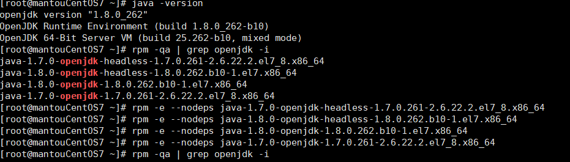
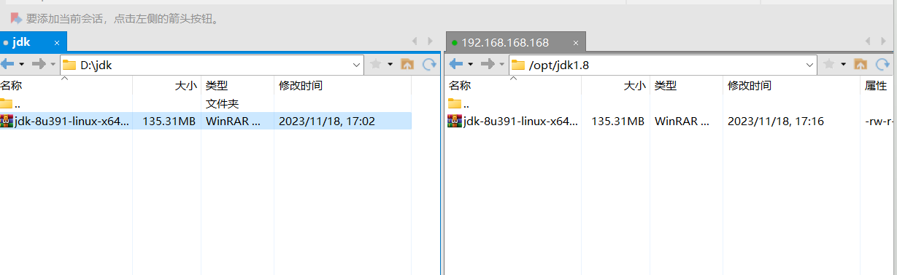
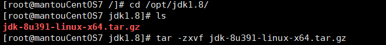
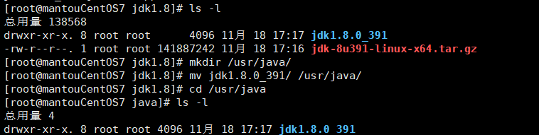
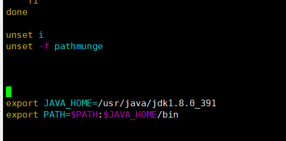
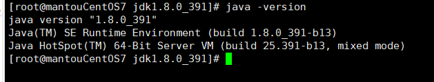

# 下载jdk

1. 建议卸载原来的openjdk，并创建一个目录用来存放jdk的压缩包
   
   
   
   

2. 用xftp把jdk传到Linux
   
   

3. 解压jdk ，并把他剪切到 /usr/java/ 目录下
   
   
   
   

4. 配置环境变量
   
   - 修改profile文件 vim /etc/profile
     
     先复制地址
     
     
     
     输入vim /etc/profile 添加环境变量
     
     
     
     esc 后 :wq 保存退出后
     
     source /etc/profile 保存配置 就好了
     
     

