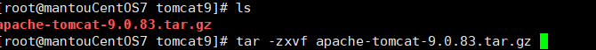
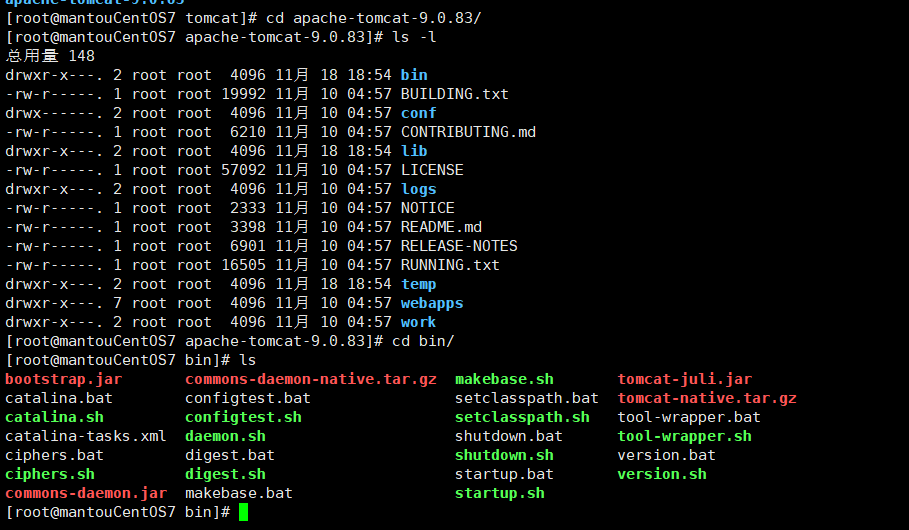
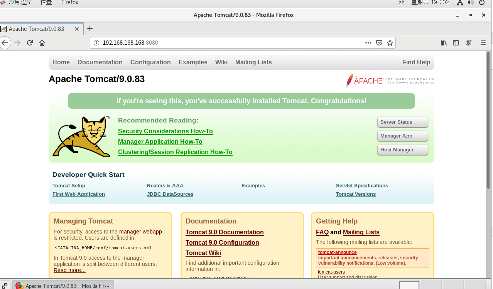

# 安装Tomcat(参考安装jdk)

1. 新建一个目录 mkdir /opt/tomcat9

2. 用xftp把Tomcat传过去

3. 解压Tomcat
   
   

4. 新建一个目录  mkdir /usr/tomcat

5. 把解压好的Tomcat剪切过去
   
   

6. 进入bin目录下面有个startup.sh 是Tomcat启动的
   
   

7. 输入 ./startup.sh 启动Tomcat

8. 浏览器访问Tomcat
   
   
