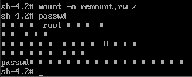

# 找回root密码

1. 在虚拟机启动的时候 按下e （快一点）
   
   

2. 在图中位置写init=/bin/sh ,后按快捷键 ctrl + x 进入单用户模式
   
   

3. 输入mount -o remount,rw /  ,然后输入passwd 更改密码
   
   

4. 输入 touch /.autorelabel  然后输入 exec /sbin/init 耐心等待重启
   
   
   
   到这里就用单用户模式成功改好了密码
