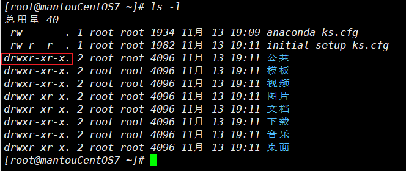

# 权限

 

drwxr-xr-x 是文件所对应的权限

0-9位

第0位是文件的类型(d,-,l,c,b)

- d:目录

- -：普通的文件

- l：链接（快捷方式）

- c：字符设备文件

- b：块设备，硬盘

剩下9位3个为一组分开

- 1-3：文件所有者的权限

- 4-6：文件所有组的权限

- 7-9：其他组的权限

rwx：为三种权限

- r（4）：read 读的权限

- w（2）：write 写的权限

- x（1）：execute 执行权限

- -：无权限

chmod：修改权限

u:所有者      g：所有组      o：其他      a：所有

chmod u=rwx,g=rx,o=x   xx.txt      xx.txt文件的所有者有全部权限，所有组有读和执行的权限，其他有执行的权限

chmod o+w xx.txt  xx对 其他人 有写的权限

chmod o-w xx.txt  xx移除其他人写的权限

通过数字更变权限

r : 4 (2^2)w : 2(2^1) x : 1(2^0)

rwx: 4+2+1 = 7

chmod u = 7 所有者有全部权限
