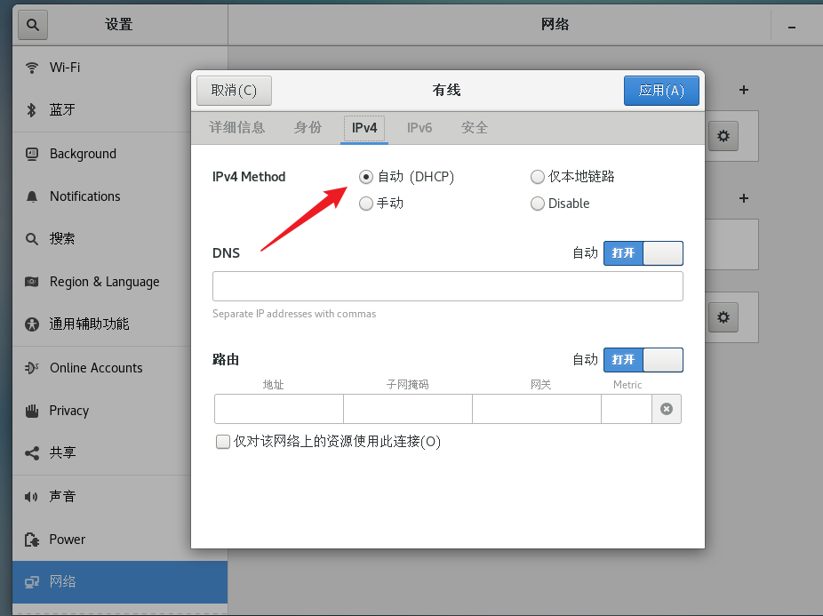

# Linux的网路配置

## 1. 网络ip的查看

- 在Windows操作系统的环境下 终端指令是ipconfig

- 在Linux的环境下是ifconfig

- ip在同一个网段才可以通讯

## 2. 网关的查看

- 点开编辑，打开虚拟网络编辑器
  
  
  
  

## 3.用ping来测试网络的连通

- 语法 ： ping 目的主机
  
  
  
  图中代表成功发送

## 4.Linux的网络环境配置

1. 自动获取ip（但是每次得到的ip不一样）
   
   
   
   
   
   

2. 指定ip（常用）
   
   - 直接修改配置文件来指定ip
   
   - 编辑vim /etc/sysconfig/network-scripts/ifcfg-ens33
   
   - 把ip地址配置成静态的
   1. 输入vim /etc/sysconfig/network-scripts/ifcfg-ens33指令
      
      
   
   2. 更改配置
      
      
   
   3. 回到虚拟机，更改配置
      
      
      
      
   
   4. 重启网络服务或者重启系统
      
      service network restart  / reboot
      
      然后就OK了
      
      
      
      

## 5.设置主机名和hosts映射

- 可以用hostname看主机名
  
  

- 用vim /etc/hostname 修改（改完重启）

--------------------------------------------------------------------------------------------------

### 设置host映射

- Windows ping Linux
  
  C:\Windows\System32\drivers\etc\hosts  里改      
  
  

        改完就可以ping 主机名了

- Linux ping Windows

    打开 /etc/hosts文件

    

    

也成功ping通了

